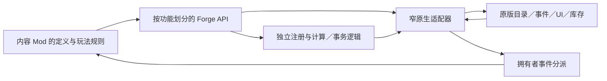

# Forge API 职责与游戏接入边界

Forge 持有通用注册、事件分派、构建门控和资源事务；内容 Mod 持有物品字段、配方、成本、成长和奖励。调用者使用下表中的公共入口，并针对同一份 Forge DLL 重新编译。框架数值见 [BuildConfig](../BuildConfig/README.md)，内容数值由所属 Mod 维护。

## 按功能调用

| API | 职责 |
| --- | --- |
| `ForgeApi` | 内容声明与依赖关系 |
| `ForgeItemApi` | 物品、节点、设施、模组 ID 和工厂；目录应用快照；创建模板实例 |
| `ForgeEffectApi` | 效果 ID、工厂、随机资格与应用快照 |
| `ForgePresentationApi` | 所属 Mod 名称、已注册物品本地化、模组与效果文本 |
| `ForgeContentApi` | 注册对象的应用／冲突／失败通知 |
| `ForgeLifecycleApi` | 读档前后、过夜前后、夜间服务、睡眠结束与日结结束事件 |
| `ForgeModuleApi` | 机器模组类型准入、已安装模组观察、属性计算与成长事件 |
| `ForgeMachineRegistrationApi` | 自定义机器模板与配方注册 |
| `ForgeMachineRuntimeApi` / `ForgeMachineBatchProcessor` | 模板运行状态、已注册机器的实时槽位读取及调用方显式执行的通用批次事务 |
| `ForgePowerApi` / `ForgeMachinePowerMath` | 原生当前机器电耗、电源操作／独立批次计费 |
| `ForgeLiquidApi` / `ForgeLiquidCompositionMath` | 容器快照、水质、组分取出与替换的纯计算及内部组分写入适配；具体转换和纯度规则由内容 Mod 持有 |
| `ForgeProductionValueApi` | 逐批材料内在价值汇总、按产量与加工倍率折算、产物生产基础价值的保存与读取 |
| `ForgeProductionValueMath` | 生产价值与液体价值的纯计算规则（无 Harmony、无原生调用） |
| `ForgeInventoryApi` | 库存读取、周目物品观察、所有权和搬运预检 |
| `ForgeRunDataApi` | 所属 Mod 的周目 JSON 读取与比较后暂存 |
| `ForgeStartApi` | 开局身份认领 |
| `ForgeWorkshopApi` | 独立工坊标签、图谱展示与事件分派 |
| `ForgeAssetsApi` / `ForgeSpriteAtlas` | 图片声明、图集路径所有权、完整发布读回、失败清理及物品赋图 |
| `ForgeSaveReadbackApi` | 有界 ES3 只读解析和唯一字段检查；调用方验证周目、所属状态及交易结果 |
| `ForgeHookApi` | 检查 IL2CPP 方法的原生执行入口，不安装内容方补丁 |

`NativeItemRegistry`、`NativeEffectRegistry`、`NativeShopAdapter` 是内部适配器，内容 Mod 通过公共入口调用。商店补货由独立适配器处理，效果注册复用物品目录就绪接入。

## 独立逻辑与原生端口

以下逻辑不依赖 Harmony、IL2CPP 或游戏单例：声明与 ID 冲突检查，机器模板冻结与配方验证，回调拥有者检查和稳定分派，模组准入规则合并，液体比例／体积／容量计算，液体价值账本的编解码与按比例保留，生产价值折算与溢出检查，耗电计费，扣电结果判定，资源事务顺序与反向恢复。测试直接编译这些源码，并使用故障注入的读写端口。

原生端口负责获得实时对象、保留委托、创建窗口、读写库存／液体／电量、读写标签与有效状态、调用原版模组计算和接收生命周期。物品与库存句柄仍是 `GameItem` 等原生对象，不能当作持久化数据或跨周目缓存。内容方先把读取到的数值传给领域规则，再在必要边界写回结果。



## 事件契约

```csharp
const string owner = "example.content";
IDisposable subscription = ForgeLifecycleApi.Subscribe(owner,
    owner + ".night_rules", ForgeLifecyclePhase.BeforeNight,
    context => ApplyRules(context.Run, context.Items));
// 功能退出或初始化失败时注销。
subscription.Dispose();
```

事件同步执行。顺序先按 `order` 升序，再按回调 ID 排序。一个拥有者抛错或其日志函数抛错不会阻止其他订阅者。排序快照在订阅变化时生成，分派复用已有快照。期间新增的订阅从下次分派生效；已注销且尚未开始执行的回调被跳过，已执行中的回调不被中断。重复回调 ID 被拒绝；订阅 ID 必须属于拥有者。

同一生命周期事件中的 `Items` 延迟读取一次，订阅者共享列表；列表内句柄的字段仍会随游戏状态变化，执行资源写入前必须重新校验。事件结束后不缓存该上下文。模块计算事件提供托管只读列表；原版学习事件的前后状态按订阅者、按调用分别保存，嵌套调用不会共享一份临时状态。

公共生命周期和模组计算 Hook 按需安装，最后一个订阅注销时撤销对应补丁。必需补丁先统一解析签名，安装失败时撤销本组补丁并停用能力；每组使用独立 Harmony ID。底层撤销失败会记录日志，已注销回调保持不活动。公共观察事件均继续原版方法。

模组准入合并已有类型，不覆盖其他 Mod 的列表。原生 ID 冲突时不替换已有工厂／效果。文本写入仅针对已成功应用的所属物品／效果。

## 机核协议调用者

- 模组矩阵 `1.1.0`：成长、节点转换／隔离／学习、市场追踪、模组仓准入和文本使用 Forge API；净水、供水、解码完成与进度速度保留内容专用接入。
- 合成扩展 `0.9.16`：新机器使用模板 API；机器倍率由批次上下文提供给本机和追加配方。原版熔炉的配方、投料、优先级和夜间调度由 `NativeFurnaceRuntime` 持有，复用通用事务。成品品质、制造效果和销售保护由内容方实现。
- 物流脉络 `0.2.0`：物品创建、目录观察、库存读取与周目数据使用公共 API；资源／电力网络有领域规则，实际搬运与网络货物持久化待实现。
- 机械飞升 `0.1.19`：注册成品及 K05 追加配方；沿用目标机器的配置倍率与当前电耗。工坊由 Forge 展示，解锁交易与保存由机械飞升持有。

机械飞升、矩阵、合成扩展的图集现通过 `ForgeAssetsApi` 加载；Forge 与机械飞升的存档读取复用 `ForgeSaveReadbackApi`。示例及其他候选见[公共服务](SHARED_SERVICES.md)。

框架拖放故障探针和合成扩展夜间边界诊断仅在 `DEBUG` 下启用。内容方的必要原生接入、图标分配与资源写入仍通过相应游戏接口完成。

## 验证边界

`scripts/Check-AdapterContracts.ps1` 只读互操作程序集元数据，不初始化游戏类。合成扩展的熔炉和液体签名由所属检查脚本在机核发布流程中核对。检查数量和当轮证据统一见[当前进度](FORGE_PROGRESS.md)。`scripts/Build-P0.ps1` 自动执行框架签名与领域检查，统一脚本再构建六个示例、四个调用者和三个 Obfuscar 发布包。编译、签名检查与哈希一致均不能证明补丁实际安装、UI 拖放、过夜效果或新档重载成功；这些需要新游戏进程和可丢弃测试档。
