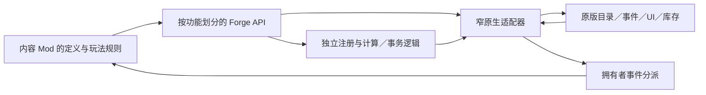

# Forge 0.5.0 API 职责与游戏接入边界

Forge 持有通用注册、事件分派、构建门控和资源事务；内容 Mod 持有物品字段、配方、成本、成长和奖励。已删除旧的 `ForgeNativeApi`、`ForgeNativeEffectApi`、`ForgeNativeInventoryApi`、`ForgeMachineApi`、`ForgeMachineLiquidApi` 入口；调用者需要重新编译，不提供兼容层或旧档迁移。

## 按功能调用

| API | 职责 |
| --- | --- |
| `ForgeApi` | 内容声明与依赖关系 |
| `ForgeItemApi` | 物品、节点、设施、模组 ID 和工厂；目录应用快照；创建模板实例 |
| `ForgeEffectApi` | 效果 ID、工厂、随机资格与应用快照 |
| `ForgePresentationApi` | 所属 Mod 名称、已注册物品本地化、模组与效果文本 |
| `ForgeContentApi` | 注册对象的应用／冲突／失败通知 |
| `ForgeLifecycleApi` | 读档前后、过夜前后、夜间服务、睡眠结束与日结结束事件 |
| `ForgeModuleApi` | 机器模组类型准入、已安装模组观察、属性计算与成长事件 |
| `ForgeMachineRegistrationApi` | 机器模板、配方及原版熔炉扩展注册 |
| `ForgeMachineRuntimeApi` | 模板／熔炉适配状态和实时槽位读取 |
| `ForgePowerApi` / `ForgeMachinePowerMath` | 原生当前机器电耗、电源操作／独立批次计费 |
| `ForgeLiquidApi` | 容器快照、水质与内部组分写入适配 |
| `ForgeInventoryApi` | 库存读取、周目物品观察、所有权和搬运预检 |
| `ForgeRunDataApi` | 所属 Mod 的周目 JSON 读取与比较后暂存 |
| `ForgeStartApi` | 开局身份认领 |
| `ForgeWorkshopApi` | 独立工坊标签、图谱展示与事件分派 |

`NativeItemRegistry`、`NativeEffectRegistry`、`NativeShopAdapter` 是内部适配器，内容 Mod 不调用它们。商店补货不再混在公开物品注册实现内，效果注册复用物品目录就绪接入，不再重复修补目录初始化。

## 独立逻辑与原生端口

以下逻辑不依赖 Harmony、IL2CPP 或游戏单例：声明与 ID 冲突检查，机器模板冻结与配方验证，回调拥有者检查和稳定分派，模组准入规则合并，液体比例／体积／容量计算，耗电计费，扣电结果判定，资源事务顺序与反向恢复。测试直接编译这些源码，并使用故障注入的读写端口。

原生端口负责获得实时对象、保留委托、创建窗口、读写库存／液体／电量、调用原版模组计算和接收生命周期。物品与库存句柄仍是 `GameItem` 等原生对象，不能当作持久化数据或跨周目缓存。内容方先把读取到的数值传给领域规则，再在必要边界写回结果。



## 事件契约

```csharp
const string owner = "example.content";
IDisposable subscription = ForgeLifecycleApi.Subscribe(owner,
    owner + ".night_rules", ForgeLifecyclePhase.BeforeNight,
    context => ApplyRules(context.Run, context.Items));
// 功能退出或初始化失败时注销。
subscription.Dispose();
```

事件同步执行。顺序先按 `order` 升序，再按回调 ID 排序。一个拥有者抛错或其日志函数抛错不会阻止其他订阅者。分派使用固定回调快照，期间新增的订阅从下次事件生效。重复回调 ID 被拒绝；订阅 ID 必须属于拥有者。

同一生命周期事件中的 `Items` 延迟读取一次，订阅者共享列表；列表内句柄的字段仍会随游戏状态变化，执行资源写入前必须重新校验。事件结束后不缓存该上下文。模块计算事件提供托管只读列表；原版学习事件的前后状态按订阅者、按调用分别保存，嵌套调用不会共享一份临时状态。

公共生命周期和模组计算 Hook 按需安装，最后一个订阅注销时撤销对应补丁。必需补丁先统一解析签名，安装失败时撤销本组补丁并停用能力；每组使用独立 Harmony ID。底层撤销失败会记录日志，已注销回调保持不活动。公共观察事件均继续原版方法。

模组准入合并已有类型，不覆盖其他 Mod 的列表。原生 ID 冲突时不替换已有工厂／效果。文本写入仅针对已成功应用的所属物品／效果。旧档修复和迁移分支已从义眼与持续成长逻辑删除。

## 机核协议调用者

- 模组矩阵 `1.1.0`：持续成长、节点转换／隔离／学习、市场追踪、模组仓准入和文本改为 Forge API。自行维护的常规 Harmony 目标由 17 个减为 4 个，保留净水、供水、解码完成与进度速度的内容专用接入。
- 合成扩展 `0.8.0`：机器使用模板 API，机器电耗和液体操作走框架；义眼进度通过周目 API 比较后暂存，扣电使用读回与补偿；读档、日结与模组统计改为公共事件。自行维护的常规 Harmony 目标由 13 个减为 10 个，保留鉴价、禁售和销售效果接入。
- 物流脉络 `0.2.0`：物品创建、目录观察、库存和周目存储走功能 API；就绪通知替换反复轮询。库存写入、路由与实际资源网络尚未开放。
- 机械飞升 `0.1.8`：注册、文本和 7 条 K05 追加配方同步重编译。

上述数量是源码中内容方维护的目标数；迁入框架的必要接入仍存在，不能据此声称所有游戏 Hook 消失。框架拖放故障探针和合成扩展的四个夜间边界诊断 Hook 仅在 `DEBUG` 下启用。图标分配、内容数据字段及原版资源写入仍需游戏接口。

## 验证边界

`scripts/Check-AdapterContracts.ps1` 只读当前互操作程序集元数据，核对 32 个签名，不初始化游戏类。`scripts/Build-P0.ps1` 自动执行它和领域检查，统一脚本再构建六个示例、四个调用者和三个 Obfuscar 发布包。编译、签名检查与哈希一致均不能证明补丁实际安装、UI 拖放、过夜效果或新档重载成功；这些需要新游戏进程和可丢弃测试档。
