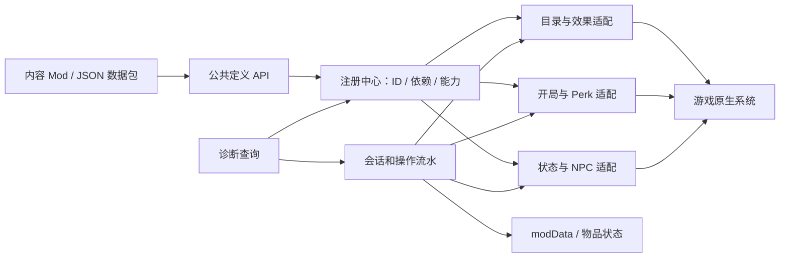

# Nicokobo Forge 详细实施方案

日期：2026-09-26。状态：方案基线，P0 诊断与注册声明原型已开始实现；各游戏内容 API 仍待原生接入与运行验证。目标游戏为 Probably Stolen Demo Steam Build `25382790`，构建身份与证据见 [证据基线](EVIDENCE_BASELINE.md)。示例中的完整内容 API 仍是拟议接口，当前已实现的 P0 接口见 [开发记录](P0_PROGRESS.md)。

## 1. 目标与首版边界

Nicokobo Forge 是独立的 MelonLoader 前置模组，让内容 Mod 注册物品、游戏内模组、节点、效果、开局角色、开局物品和 Perk，并统一处理生命周期、存档与诊断。后续在相同基础上提供 NPC 与左上角状态看板。

首版必须做到：两个内容 Mod 同时接入；每项注册有稳定所有者和 ID；新局、读档、换槽、重开界面都不重复执行；缺少依赖或游戏构建变化时按能力停用并报明原因。首版不要求接管现有第三方 Mod，也不承诺热卸载自定义物品后旧档仍可读取。

这里 `Mod` 指外部插件，`Module` 指游戏内机器模组，`Node` 指游戏内节点，`Effect` 指游戏内效果。`Start` 分两类：附加在现有职业上的开局档案，以及真正拥有独立选择卡和身份的开局角色。两类共享初始化服务，但后者要经过额外的新局与存档验证。

## 2. 独立项目与发布形态

项目位置 `D:\workzone\nicokobo-forge`，维护自己的源代码、文档、构建脚本和版本。拟定后续结构：

```text
nicokobo-forge/
  README.md
  docs/IMPLEMENTATION_PLAN.md
  docs/EVIDENCE_BASELINE.md
  src/Nicokobo.Forge/       # 公共 API、注册中心、运行时和游戏适配器
  tests/Nicokobo.Forge.Domain.Tests/  # 无游戏依赖的规则与存档格式测试
  samples/Nicokobo.Forge.ExampleOne/  # 完整内容样例
  samples/Nicokobo.Forge.ExampleTwo/  # 多 Mod 共存、冲突和依赖样例
  tools/                    # 构建指纹与探针工具
```

第一版用 **一个 `Nicokobo.Forge.dll`** 发布公共类型与运行时。内容 Mod 编译时引用同一程序集，不复制到自己的包中；安装时先满足 MelonLoader 的依赖顺序，且 Nicokobo Forge API 对“运行时尚未就绪”返回明确状态。P0 用两个独立 DLL 测试加载次序和类型身份，再决定是否需要把契约独立为 `Nicokobo.Forge.Abstractions.dll`。公共 API 不引用游戏原生类型；`Nicokobo.Forge.Advanced` 的版本相关入口可显式暴露原生对象，但不保证跨构建稳定。

拟使用 `net6.0`，与现有项目的 MelonLoader、Harmony、Il2CppInterop 依赖保持一致。游戏 DLL 只作为开发时引用，`Private=false`；发行包只包含 Nicokobo Forge 的 DLL、必要资源和说明。`GameDir` 使用项目本地用户覆盖文件配置，不在提交的文件中写个人安装路径。首次建工程时先编译空 Mod 并核对实际加载日志。

## 3. 系统结构与职责



| 组件 | 实现职责 | 不对外泄露的细节 |
| --- | --- | --- |
| `Nicokobo.Forge.Api` | 不可变定义、稳定 ID、结果类型、服务接口、事件上下文 | 原生对象、Unity 控件、IL2CPP 委托 |
| `Nicokobo.Forge.Core` | 注册批次、依赖排序、所有权、资源引用、能力状态、调度与异常隔离 | Harmony 补丁实现 |
| `Nicokobo.Forge.GameAdapters` | 按构建检查签名；优先接游戏事件/目录，缺口用窄 Harmony 补丁 | 旧 RVA、字段偏移、模板内部布局 |
| `Nicokobo.Forge.Persistence` | 周目身份、Mod 独立数据、迁移、操作流水、保存读回 | 玩家设置与周目状态混用 |
| `Nicokobo.Forge.Presentation` | 本地化、资源、开局卡、Perk/UI、状态投影 | 业务操作藏在 UI 回调 |
| `Nicokobo.Forge.Diagnostics` | 能力可用性、冲突、补丁 owner、保存/发放结果 | 将未知状态写成成功 |

## 4. 注册 API 的形态与规则

### 4.1 作者入口

内容 Mod 在自己的加载入口提交声明。以下仅是设计示意，具体 C# 签名在 P0 样例编译后冻结：

```csharp
public override void OnInitializeMelon()
{
    ForgeApi.Register("author.example", "0.1.0", content =>
    {
        content.RequireCapability("items", minVersion: "1.0");

        var module = content.Modules.Add("starter_module", new ModuleSpec
        {
            Template = "module_small",
            Size = new GridSize(1, 1),
            Stats = new ModuleStats(performance: 4, efficiency: 0, quality: 0),
            Name = LocalizedText.ZhEn("启动模组", "Starter Module"),
            EffectIds = { "author.example.effect.starter" }
        });

        content.Starts.Add("engineer", new StartSpec
        {
            DisplayName = LocalizedText.ZhEn("工程师", "Engineer"),
            PerkBudget = 3,
            Opening = OpeningPlan.Create()
                .GrantItem("first_module", module.Id, 1, Destination.PlayerInventory)
        });
    });
}
```

短 ID 自动扩为 `owner.type.name`；跨 Mod 依赖使用完整 ID，并声明版本要求。不能用显示名、原生枚举数字、临时目录顺序或原生指针作内容 ID。已发布 ID 不随翻译和类名重构改变。

### 4.2 注册事务

注册分 **声明 → 验证 → 预留 ID → 等原生目录就绪 → 应用 → 自检 → 发布**。提交整批先检查 ID、依赖环、字段范围、资源路径、跨定义引用及所属能力。引用可在同批次前向指向。不同作者同 ID 一律冲突；同作者同定义在目录重建时可幂等恢复，不同定义不能偷偷覆盖。`Module`/`Node` 由统一物品注册器生成目录工厂，避免同一 ID 在多个表中重复创建。

每项能力状态为 `Unavailable / Waiting / Ready / Degraded / Disabled`，记录构建特征、失败阶段和具体依赖。原生字典部分写入后未必能安全回滚：预检尽量提前，实际失败则门控其工厂/回调，并阻止依赖内容进入新局。已存在的原生同名项不被 Nicokobo Forge 清除。

加载顺序只决定何时提交声明，应用顺序由 Nicokobo Forge 根据依赖和目录就绪事件安排。保存恢复前需要注册所有会被存档解析引用的物品及效果；P0 必须证明是否做得到。若做不到，就关闭该类存档写入能力，不能靠读档后补注册掩盖损坏。

### 4.3 版本与兼容

三个版本分别声明：公共 API 语义版本、适配的游戏构建指纹、每个内容 Mod 的保存格式版本。启动时核对游戏 DLL 哈希、生成程序集哈希与目标方法完整签名。未知构建可保留独立于游戏的定义解析和诊断；具体游戏写入能力按验证结果停用。不要把哈希相同误当成所有场景已通过游戏运行验证。

## 5. 各领域的大致实现

### 5.1 物品注册与创建

物品定义包含目录类型、模板 ID、形状占格、单位数、堆叠策略、标签、价格、资源、名称与描述、获得路径。适配器在对应目录的 `InitDirectory` 完成后检查 `Has` 并 `Add(id, factory)`；工厂从经验证的模板 `DirectoryMaster.Item(templateId, true)` 创建新实例，复制或重建可变字段，再设置自定义数据并自检。工厂委托由 Nicokobo Forge 按目录寿命持有，避免托管委托被回收。

`Items.Create(id)` 只创建实例；`Inventory.TryGive(...)` 另行检查所有权、目标存储、格子、接受数量并读回。这防止“目录存在”被误当成“玩家已获得”。每个实例使用原生可保存身份或独立的稳定实例键；复制、堆叠和拆分要逐项检查状态是否正确继承。普通物品先支持 `MiscItemDirectory` 与 `ModItemDirectory` 可验证路径，食品、容器、机器后续扩展。

### 5.2 机器模组、节点与效果

`Modules`、`Nodes` 是物品定义的专门构造器。模组声明机器适用范围、性能/效率/质量、形状和效果槽；节点声明 NODE 类型、形状、目标/邻接方式。适配器复用原生初始化方法与标签，创建后核对 `MODULE`/`NODE` 类型、形状、效果槽及原生模板 ID 是否已替换。

`Effects` 注册 `ModuleEffectHelper.moduleEffects` 的完整定义：效果类型、名称、说明、互斥、创建/重算/成功工作回调。IL2CPP 委托由 Nicokobo Forge 缓存；效果应在任何含它的存档物品解析前注册。显式 `Distribution.None/OnGeneratedModule/OnGeneratedNode` 决定随机分发；单纯加入全局字典不自动获得掉落权。P0 要核对当前原版随机过滤逻辑，再选局部过滤钩子，避免以 `Universal` 类型当“排除随机”的承诺。

重算在同一次事务里从基础值和邻接快照得出临时贡献，写入前统一取整，不能在旧 `TEMP_*` 上叠加；按效果 ID 和能力阶段给出确定顺序，并检测循环/重入。原版与其他 Mod 的效果不受 Nicokobo Forge 内部顺序保证，混合舱需单独实测。成功工作回调用机器、工作序号和物品实例身份去重；UI 刷新、失败工作与纯重算不增长。首版只开放经测试的基本属性、邻接查询与简单效果，转换/隔离/熔断在能截取贡献来源后逐项开放。

### 5.3 开局角色与开局初始化

`StartSpec` 包含稳定 ID、卡片文本/图像、可选条件、Perk 规则、基础职业策略与初始化计划。现有原生职业附加档案可先通过 `ExistingStartProfile` 路线运行；独立角色需要把菜单选择意图、原生基础职业/自定义编号、第一次存档和读档显示贯通，不能仅新增一张卡。独立路线按当前 `PlayableStartFlow` 的绑定/门控思路做受控原型，具体原生承载策略由 P0 的首次存档证据决定。

初始化计划的操作类型至少为：发放或移除物品、设置/增减资金、增加状态、调整已验证的商店数值。`Set` 与 `AddDelta` 必须分开命名；操作标明目标库存和条件。顺序为：选择预览（只读）→ 新局资格复检 → 绑定槽位/runID → 原版发放完成并取得基线快照 → 执行已批准的差异 → 首次保存 → 从目标槽读回 → 发布周目就绪。

每个发放操作用 `(slotId, runID, ownerId, operationId)` 标识，保存 `Prepared / Applying / Applied / Committed / NeedsRecovery` 和实际数量、实例身份、落点。满库存根据声明的 `BlockStart/QueueDelivery` 策略处理；未成功不写完成。重复回调、游戏崩溃和读档回放先对账再恢复，证据不足时冻结该操作并显示恢复原因。首次存档可能已改动原生槽位索引，能否安全拒绝或清理由探针决定；没有可验证边界前独立角色能力不开放。

### 5.4 Perk 与点数

`Perks.Add` 登记 ID、名称、说明、图标、费用、互斥、可用开局与效果触发点。原生候选入口为 `StartingPerkList.InitStartingPerk`、`StartingPerkIconLoader.Start`、`PerkUIController.OpenUI/OnChange/CanStart`；当选择 UI 重新生成时按稳定标记去重。选择结果以原生保存的已选 Perk 为准，效果只对命中的 ID 执行。

点数服务保存来源清单，例如原生基础值、开局修正和内容 Mod 修正。`总点数 = 原生基础值 + 各来源增减`，`剩余点数 = 总点数 - 已选费用总和`；负费用、最大数量、负面 Perk 个数、互斥分别校验。来源以 ID 去重；若内容需独占覆盖基础值，多个覆盖者冲突时报错。打开、选择、取消、换开局和确认时调用同一计算器，UI 文本与游戏资格同步。不得仅修改 `pointCount` 或 `slotCounter` 文本。

### 5.5 状态与左上角看板

状态定义包含层数上限、叠加方式、持续域（游戏日、成功工作次数、运行游戏时间等）、来源与到期回调。状态实例保存在周目数据，状态的实际玩法效果走消费该数据的原生判定或 Nicokobo Forge 事件。UI 仅展示，不作为状态来源。

先做一个只读状态查询与独立 IMGUI 展示原型，复用现有 `StatusOverlay` 按 `revision/runID/day/locale` 缓存的经验；再定位用户所说的左上角原生看板控件与刷新方法。确认可安全注入后提供 `StatusBoard.Add(entry)`，图标、排序、可见条件与详情由统一投影层生成。关闭/打开 UI、切场景、换档时清理旧引用，界面刷新不触发状态效果。

### 5.6 后续 NPC

`Npcs.Add` 拆为静态顾客模板、生成/到访规则、当日实例和跨日进度。优先评估 `ModHook.OnGenerateCustomer*`，再确认 `StoreClientManager` 的列表和原生生成器是否能安全接受自定义模板。NPC 的头像、对话、库存、交易、重复到访和任务状态逐项独立验证；不能因为能插入一位顾客就宣称完整 NPC 管理可用。

## 6. 存档、数据包和卸载行为

周目数据优先使用 `PlayerStore.modData` 的 `nicokobo.forge` 根键，下挂 `ownerId → schemaVersion → data`，与 `runID`、`saveSlotId` 共同校验；物品自身状态优先放入已验证可保存的实例标签。每个 owner 提供迁移函数，未知未来版本保留原始内容并停止写入。配置文件和周目数据分开，初始定义变化不自动改写旧周目。

JSON 数据包在完成 C# API 的闭环后再加入，用同一份 schema 和注册器，不另建旁路。先支持不需要回调的名称、资源、物品、简单模组、开局计划与数值效果；复杂玩法只接受代码注册。定义解析设置大小、路径、重复 ID 和跨引用限制。

缺少必需内容 Mod 的存档要在最早可验证的读档入口报告缺失列表；在无法安全继续时阻止写回，而不是自动删除自定义物品。卸载指引包含备份和依赖列表。多文件侧车仅在原生 `modData` 无法承载时采用，并增加保存代次与崩溃对账，不能假设两份文件同一事务。

## 7. 与现有项目的关系

`custom-start-framwork` 是现有职业附加 Perk 的参考与兼容对象。第一版以同时安装、点数/UI 不冲突为目标；其 `profile.json` 可在迁移工具中映射为 Nicokobo Forge 的 `ExistingStartProfile`，但保留原始 ID、字段语义和存档所有权。迁移前不让两套框架对同一档案同时发放。

`probably-stolen/mods-melonloader/aug-mechanical-ascension` 提供物品/效果、会话绑定、操作流水、保存读回及只读状态面板的实现样本。Nicokobo Forge 先抽出通用规则和接口，再让一个最小示例接入；现有游戏 Mod 的行为和旧存档保持原样。`MODULE_NODE_EFFECT_EXPANSION_IMPLEMENTATION_PLAN.md` 的内容包可作为后续复杂规则验收样本，其中未验证的转换/隔离规则不能直接标记为框架能力。

现有 Mod Manager 可通过只读诊断接口展示 Nicokobo Forge 依赖、注册情况和失败原因；Nicokobo Forge 不自行管理其他 DLL 的启停。

## 8. 分阶段实施步骤

| 阶段 | 具体工作 | 验收与产物 |
| --- | --- | --- |
| P0：构建与探针 | 独立工程、构建配置、空插件加载；游戏指纹/完整签名门控；目录、效果、Perk、新局、保存、看板探针 | `docs/probes/` 记录可复现时间线与失败；未知构建不执行写入；两示例 DLL 的加载/依赖关系清楚 |
| P1：核心注册 | 公共 API、ID/所有者、批次验证、依赖排序、能力状态、日志与诊断 | 两 Mod 前向引用、重复注册、ID 冲突、缺失依赖和目录重建分别得预期结果 |
| P2：物品/效果闭环 | 物品工厂、模组/节点特化、效果委托与随机策略、资源/本地化、一次简单成功工作效果 | 两件实例不串状态；创建、装入、重算、工作、保存重启回读成立；随机池无意外条目 |
| P3：Perk 与原生职业附加档案 | Perk 注册、图标、点数与数量计算、互斥、现有职业开局计划、兼容旧框架 | 显示/选择/确认一致；选中/取消、负费用、换职业、两 Mod 共存；一次性物资不重发 |
| P4：独立开局角色 | 菜单卡、短期意图、原生承载、首次保存门控、槽位/runID 对账、读档预览 | 取消无泄漏；首次保存失败处理明确；旧存档和其他职业不受影响；满库存可恢复 |
| P5：状态与看板 | 状态定义、叠加/到期、周目保存、只读投影、定位并接入左上角面板 | 状态效果与 UI 一致；跨天、重开面板、换档、语言切换无重复或旧引用 |
| P6：扩展 | NPC、商店/掉落/配方接入，声明式数据包、Mod Manager 诊断集成 | 每个能力独立列出探针与验收，不影响 P1–P5 已发布 API |

首个纵向样例包含：一个普通物品、一件机器模组、一个节点、一个效果、一个 Perk、一个现有职业档案、一次开局发放与周目读回。第二个样例故意设置相同 ID、缺失依赖和预算修正，证明框架的多 Mod 行为。P4 再把一个独立卡加入第一样例，避免以最危险的首次保存路径作为框架起点。

## 9. 测试矩阵与发布门槛

纯逻辑测试覆盖 ID、依赖环、点数/负费用/互斥、形状、状态时钟、注册批次和存档迁移。适配器测试使用当前游戏构建和可丢弃存档：主菜单取消、首次保存、加载、换槽、满格、效果重算、真实机器工作、退出重启、缺失依赖。故障注入至少覆盖注册中途失败、库存接受后日志未提交、保存失败、旧回调到达、未来数据版本与同 ID 竞争。

每项能力区分四层证据：签名核对、编译通过、加载器日志、游戏内完整路径。发布包必须注明实际通过的游戏构建、能力状态、依赖版本、已知存档限制与从旧版迁移的操作。首版不以“能创建物品”替代“物品可存读和起作用”。

## 10. 第一批开发任务

1. 建立 `src/Nicokobo.Forge`、两示例 Mod 和独立构建脚本；验证 MelonLoader 加载顺序及 API 程序集身份。
2. 做构建指纹与方法完整签名探针，输出按能力的可用性报告。
3. 记录目录初始化、效果注册/随机分发、保存/读档的实际事件顺序。
4. 实现注册批次、稳定 ID、依赖、幂等目录恢复及冲突诊断。
5. 用一个 1×1 模组和节点完成物品/效果/工作/保存纵向样例。
6. 接入 Perk、点数与现有职业档案，完成真实 UI 与新局读回。
7. 取得首次保存和左上角面板探针证据后，依次开放独立开局和看板能力。
