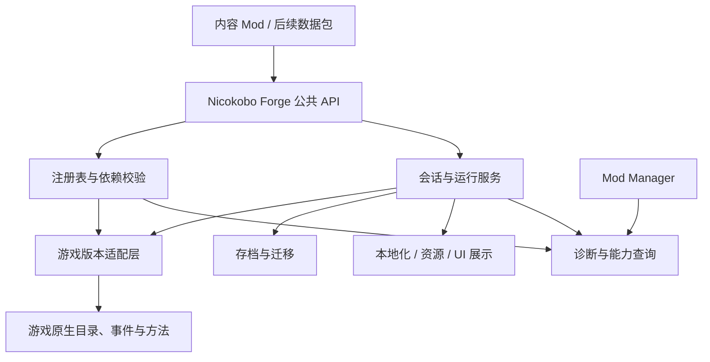

# Nicokobo Forge 前置模组：总体设计草案

日期：2026-09-25。状态：方案阶段，未创建框架工程；下列 API 为拟议接口，不表示已经实现或通过游戏运行验证。

## 1. 定位与边界

Nicokobo Forge 为 Probably Stolen 内容 Mod 提供统一的注册、生命周期、运行操作与持久化 API。内容作者描述“是什么、何时触发、产生什么结果”，框架处理目录时机、原生接口、委托寿命、存档和 UI 接入。

建议产品名为 **Nicokobo Forge**，公共命名空间为 `Nicokobo Forge`，工程目录为 `mods-melonloader/nico/`。首版沿用本地工程的 MelonLoader、net6.0、Harmony、Il2CppInterop 依赖方式。

术语明确区分：`Mod` 为外部插件；`Module` 为游戏内机器模组；`Node` 为游戏内节点；`Effect` 为模组或节点的效果；`Status` 为玩家/角色身上的持续状态。

Nicokobo Forge 管理主动接入的内容及其依赖，不承诺自动接管第三方 Mod 的补丁。现有 Mod Manager 继续作为管理界面，可展示 Nicokobo Forge 提供的依赖和注册诊断。运行中卸载含自定义内容的 Mod 不列入首版。

## 2. 总体架构



代码职责分为 `Api/`、`Core/`、`Adapters/`、`Persistence/`、`Presentation/`、`Diagnostics/`。先保持一个运行时发布包，不为每项服务拆一个必装 DLL；是否单独交付纯 API 程序集由最小原型验证后决定。

公共定义尽量不引用原生 `GameItem`、Unity 对象或 IL2CPP 委托。框架提供稳定 ID、实例句柄、只读上下文和受控操作；确需原生能力时通过明确标为版本相关的高级适配接口访问。

## 3. 能力划分

| API 服务 | 负责内容 | 主要边界 |
| --- | --- | --- |
| `Mods` | Mod 身份、框架版本范围、必需/可选依赖、能力要求、注册结果 | 不代替加载器；不自动管理未接入插件 |
| `Items` | 普通物品定义、模板、占格、价格、类型、标签、堆叠、图像、创建 | 创建和投放分开；每次创建拥有独立可变状态 |
| `Modules` | 基于物品的机器模组定义、三属性、允许机器、效果引用 | 不重复注册同一物品；不内置某个内容包的平衡规则 |
| `Nodes` | 基于物品的节点定义、形状、邻接与目标选择规则、效果引用 | 复用物品实例身份；复杂传播只在适配验证后开放 |
| `Effects` | 效果定义、适用类型、槽位、互斥、随机分配策略、计算/工作回调 | 注册可解析不等于加入随机池；随机分配默认显式开启 |
| `Starts` | 可玩开局角色/身份、卡片、解锁、基础开局、Perk 策略、初始化计划 | 菜单预览不改周目；对外不暴露原生开局枚举整数 |
| `StartingLoadouts` | 开局物品、资金、升级和初始状态，及按条件追加内容 | 一次性执行、部分成功、待交付和读档对账 |
| `Perks` | Perk 定义、费用、互斥、可选条件、效果事件 | 与点数服务共用校验；普通运行回调不隐含发放权限 |
| `PerkPoints` | 点数预算、来源修正、已选费用、可选数量上限、剩余点数 | 点数和数量分别管理；UI 与确认开局使用同一结果 |
| `Statuses` | 持续状态定义、来源、层数、时长、刷新/叠加/到期规则 | 状态是真实玩法数据，UI 只读取它 |
| `StatusBoard` | 左上角看板条目、图标、说明、数值、排序、可见条件 | 可展示纯信息；不依靠 UI 回调执行效果 |
| `Npcs`（后续） | NPC 定义、肖像、对话入口、库存策略、到访日程和实例状态 | 模板、当前访客实例、一次到访分别标识 |

共同基础服务：`Localization`、`Assets`、`Events`、`SaveData`、`Capabilities`、`Diagnostics`。物品投放先服务开局，商店/掉落/配方来源作为后续独立接入点。

## 4. 注册模型与生命周期

### 内容定义与运行实例

- 定义在进程内注册，如某一种模组、Perk、开局；默认不可变。
- 实例在周目内创建，如背包中的一件模组、一个状态、一次 NPC 到访。
- 派生数据可重算，如临时三属性、邻接、看板文本；不当作持久化事实重复保存。

每个 Mod 获得自己的注册上下文，ID 示例：`author.content.item.power_module`。内容 ID、实例 ID、操作 ID 分开；不能用原生指针或本次加载序号充当跨存档身份。

### 注册过程

`提交定义 → 全量校验 → 依赖排序 → 等待对应原生目录 → 应用注册 → 发布能力状态`。

1. Mod 启动时只提交定义，不要求场景对象已存在。
2. 校验命名空间、重复 ID、资源、引用、数值范围和依赖环；同一批次允许前向引用。
3. 必需依赖失败时阻止依赖模块激活；可选依赖缺失只关闭对应扩展。
4. 同一所有者、同一版本定义的目录重建可幂等恢复；同 ID 的不同定义或不同所有者报冲突，不能静默覆盖。预检已发现的冲突双方均不激活；较晚发现的外部原生 ID 冲突拒绝 Nicokobo Forge 新写入并报告原所有者。
5. 模组和节点定义内部生成一次物品注册，避免三个注册表各自创建工厂。
6. 效果与物品解析必须先于依赖它们的存档恢复。不能只在新物品工厂第一次执行时才注册效果。
7. 应用失败不承诺原生全局状态可完整回滚：可撤销的只撤销自身写入，否则整项能力保持不可用，并阻止依赖内容进入新局/读档路径。

生命周期分为目录就绪、菜单就绪、新局准备、新局提交、读档恢复、周目就绪、场景就绪、日界、保存和结束。只有 `RunReady` 才可取得有效周目上下文；切换存档后旧句柄失效。所有游戏写操作在游戏主线程执行。

## 5. 关键运行约定

### 模组、节点与效果

将“创建初始化”“属性重算”“成功工作”“恢复实例”拆成独立回调。重算从当前基础快照生成本轮贡献，不在上次临时值上反复累加；恢复不重跑创建奖励。

效果计算声明执行阶段和依赖，提供稳定顺序，检测环和重入。框架保留贡献来源，便于说明某个加成来自哪件物品。首版实现基础属性、简单效果和邻接查询；转换、隔离、熔断等复杂规则由内容 Mod 实现，框架在验证对应钩子后提供能力。

每次成功工作需要稳定的工作事件身份；不以帧号代替，不把失败工作、UI 刷新和属性重算算作成功。兼容原生与未接入 Mod 的混合舱行为需单独测试，不能仅凭 Nicokobo Forge 内部排序宣称全局确定性。

### 开局与初始内容

`选择卡片 → 创建短期选择意图 → 预检开局与 Perk → 建立周目身份 → 应用初始化计划 → 首次保存/核对 → 周目就绪`。

初始化顺序要与原生保存窗口一起验证；不得用一个通用的场景加载完成回调替代整条流程。切换角色、取消、返回菜单、读档时使旧意图失效。

计划中的每个操作使用稳定键，记录未执行、部分完成、已完成及可诊断失败。物品发放走原生接纳规则，记录实际落点和剩余数量；满库存可选择延后交付或阻止开局，不能静默丢弃。多 Mod 对同一初始内容的“添加、移除、替换”必须显式声明，冲突的独占替换拒绝应用。

读档恢复已执行结果，不再次发放。实例/操作标识和保存后对账共同防重；一个内存 `bool` 或仅在发放后写完成标记不足以解决崩溃窗口。无共同事务时保留待对账状态，无法判断是否完成的操作不盲目重试。

### Perk 与点数

建议预算模型：`可用总点数 = 开局基础预算 + 各来源增减`，`剩余 = 可用总点数 - 已选 Perk 有符号费用总和`。负费用 Perk 可按策略返还点数；预算边界、负面 Perk 上限和可选总数独立定义。

每个来源按稳定键登记修正，重复登记不会累加。需要覆盖基础预算时使用显式独占策略，多个覆盖者冲突时报告错误。打开面板、选择、取消、切换角色和确认开局都调用同一计算/校验服务；仅当有合法选择方案时才允许继续。

### 状态与左上角看板

`StatusDefinition` 描述一种状态，`StatusInstance` 保存来源、层数、持续时间和自定义数据，`StatusBoardEntry` 负责展示。

状态明确计时域，例如游戏日、有效工作次数或游戏运行时间；暂停/跨天/读档语义不能混用现实时间。叠加策略可选独立实例、叠层、刷新时长或取最强，必须声明上限和来源移除规则。

看板既可投影状态，也可显示“待交付物品数量”等只读信息。按状态变更刷新，使用显式失效或低频刷新处理动态文本。UI 重建不重复加效果、不重复扣层数。左上角原生看板的准确入口尚需探针核对，因此后期接入，不宣称已有通用接口。

## 6. API 使用体验示意

下例仅表达目标使用方式，类型与签名待原型收敛：

```csharp
public void Register(IForgeRegistration forge)
{
    var mod = forge.Mods.Declare("author.example", "0.1.0");

    var module = mod.Modules.Define("starter_module", new ModuleDefinition
    {
        Name = LocalizedText.Create(zh: "启动模组", en: "Starter Module"),
        Shape = Shapes.Rectangle(1, 1),
        BaseStats = new ModuleStats(Performance: 4, Efficiency: 0, Quality: 0)
    });

    mod.Starts.Define("engineer", new StartDefinition
    {
        Name = LocalizedText.Create(zh: "工程师", en: "Engineer"),
        PerkPolicy = PerkPolicy.WithBudget(3),
        Loadout = Loadout.Plan()
            .Grant("initial_module", module.Id, quantity: 1)
    });
}
```

启动器负责调用一次声明入口，Nicokobo Forge 在原生目录就绪后应用。短 ID 自动带所有者前缀，跨 Mod 引用使用完整 ID；`Grant` 中的操作键用于一次性发放身份。单次运行的奖励必须通过周目上下文服务执行，不能在注册回调直接修改库存。

注册和写操作返回结构化结果，例如成功、未就绪、冲突、待交付、缺失能力；日志包含 Mod ID、内容/实例 ID、操作键和失败阶段。错误不能被统一吞掉后报告成功。

## 7. 存档、兼容与诊断

- 周目数据优先使用已验证的游戏存档扩展，物品状态优先使用可回读的物品字段；存档槽、周目、Mod、内容和实例各有身份。
- 每个 Mod 的数据有独立 schemaVersion 与迁移函数；未知未来版本保留原数据并停用对应写入，不覆盖成默认值。
- 若必须使用侧车文件，记录原生保存代次并设计崩溃对账，不能视两个文件为一个事务。
- 读取含必需缺失内容的存档时，在可拦截的最早入口阻止继续并列出依赖，不自动删除物品或写回清洗存档。能否完整前置检测需要验证；首版不承诺无损卸载。
- 区分 API 版本、游戏适配版本与存档版本。内容 Mod 声明最低 API/能力，适配器核对游戏构建和完整签名；不兼容的能力单独关闭。
- 框架持有托管及 IL2CPP 委托，按对应目录/会话寿命释放。异常回调按所属功能隔离；注册或必需初始化失败阻止激活，读档数据失败不能默默跳过。
- 诊断提供依赖图、内容来源、能力就绪状态、ID 冲突、失败注册、待交付、迁移失败与补丁所有者。先输出日志和只读查询，后续供 Mod Manager 展示。

## 8. 分期实施与验收

| 阶段 | 范围 | 完成标准 |
| --- | --- | --- |
| P0：最小框架 | Mod 上下文、稳定 ID、注册批次、能力门控、日志、会话/存档骨架 | 两个示例 Mod 可同时接入；依赖缺失/ID 冲突可定位；换档无串状态 |
| P1：内容注册闭环 | 普通物品、基础模组/节点、简单效果、本地化与资源 | 创建、放入、旋转/重算、工作、保存重启回读；多个实例独立且重算不累加 |
| P2：开局闭环 | 开局角色、Perk 注册与点数、初始化计划、待交付 | 取消/切换无泄漏；UI 与提交规则一致；满库存、部分失败、重载不重复发放 |
| P3：状态与看板 | 状态实例、叠加/到期、看板投影、管理器诊断接入 | 展示与效果一致；跨天、暂停、读档、重复打开面板符合策略 |
| P4：扩展接入 | NPC、商店/掉落/配方、复杂效果钩子、数据包 | 按真实内容需求逐项验收；不以预留接口充当已支持能力 |

首个开发样例贯穿 P0–P2：一个开局、一个普通物品、一个机器模组、一个节点、一个效果、一个 Perk，以及开局发放和保存恢复。另加第二个极小 Mod 验证注册与点数来源共存。先形成小而完整的可用闭环，再冻结首批公共 API。

现有神经接口和扩展内容可逐项迁移为使用者，但先保留现有行为基线。迁移按“新增框架能力 → 示例验证 → 单项接入 → 保存/运行回归”推进，不一次性搬空当前 Mod；旧存档身份和已有内容 ID 需保持或显式迁移。

## 9. 当前依据与待验证项

已查看本地 `aug-mechanical-ascension/Integration/NeuralModuleDirectory.cs`、`PlayableStartFlow.cs`、工程依赖，以及模组/节点/效果扩展实施方案和 Mod 开发场景指南。

现有代码包含物品工厂、效果委托与注册，以及使用原生 `StartType=55` 的开局接入；这些是抽取参考，不是 Nicokobo Forge API 已存在的证据。旧记忆中的开局状态不能替代当前代码与运行记录。本次未运行游戏、未进行框架编译或行为验证。

进入实现前优先核对：目录重建与读档顺序、成功工作事件身份、效果随机池过滤、首次保存提交窗口、Perk 完整重算路径、原生看板入口、存档依赖前置检测，以及混合 Mod 的调用顺序。
